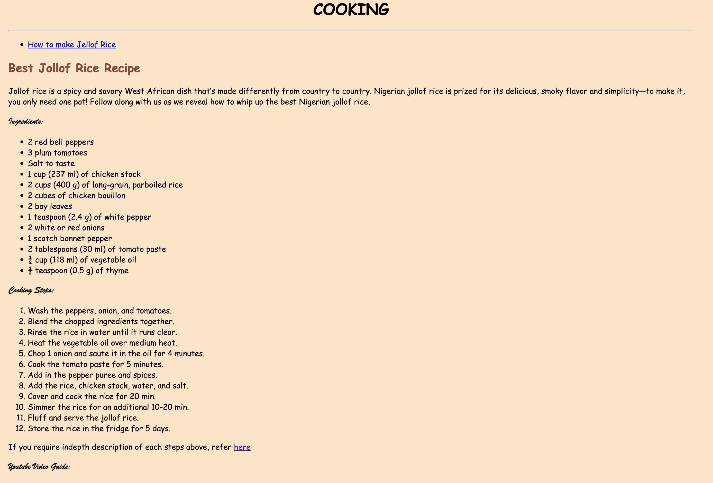

# Title
Life Hacks: Career, Cooking & Religion

# lifehacks Project Description
This projects contains insights on how to achieve various life's tasks or goals

### Site Link
https://tobeosueke.github.io/lifehacks/

# User Experience 

This section provides information about the goal of this site, target audience and use stories.

## Goal 
The goal of this project is to present a system that provides contents focusing on giving gudiance on how to performing various life tasks. The project contains external link

## Target Audience
. Users that are looking for life hacks information in their professional, home(cooking) and religious life
. Users that want information on how to get a job in Ireland
. Users that want to learn how to cook food from other nationality
. Users that want to know how to transform their Christian Faith

## User Stories
. The home page provides description of the site and contains clear navigation links to view each pages.
. Users looking for career information can go striaght to the career page
. Users secking cooking hacks, can visit the cooking page directly

# Categories
In this project you will find tips and guidances in three major category of life:
1. Professional or Career
2. Cooking
3. Regious - Christian Faith

# Feature Section
Below are the features present in this website:

### Site Navigation
Each pages oof the site contains a menu bar that looks like the image below:

### Pages 
Each categories has their pages and topics under a category is displayed on same page with same-page navigation. Below are a description of all the pages:

1. Home Page - This page presents a description of the website and display a link to various categories

2. Career Page - Shows the menu bar, list of topics for this category and footer

3. Cooking Page - Shows the menu bar, list of topics for this category and footer

4. Christian Faith Page - Shows the menu bar, list of topics for this category and footer

#### Home Page Content
The contents of the home present site title, site description and site categories with a list to each each topics in each categories. See image below:

#### Career Page Content
The contents of the career present page title, link list of topics for this category. The links are in-page. Meaning that clicking on any of the link will take you directly to the section of that topic on the career page. 

Note: This page contain links to other websites and clicking on them will open in a different tab on the browser
See image below:

#### Cooking Page Feature
The contents of the cooking present page title, link list of topics for this category. The links are in-page. Meaning that clicking on any of the link will take you directly to the section of that topic on the cooking page. 

Note: This page contain an iframe displaying a YouTube video that users can control
See image below:

#### Christian Faith Page Feature
The contents of the christian faith present page title, link list of topics for this category. The links are in-page. Meaning that clicking on any of the link will take you directly to the section of that topic on the christian faith page. See image below:

# Testing
The site was fully tested during the entire process of developemnt. Below are list of test performed:

1. Internal and External Links: All internal links were tested to open in the same tab, while external links on a new tab.

2. Mobile/Tab/Laptop Viewing: The responsiveness of site was tested using Chrowm's browser developer tool. Each pages were viewed on different screen type to ensure that contents (images and text) respond to different screen size.

3. Validator Test: Using the official W3C validator (https://validator.w3.org/nu/#file) and Jigsaw validator (https://jigsaw.w3.org/css-validator/), both HTML and CSS files were checked and no errors were found after development.

#### Possible Bug:
Even after using the correct html anchor target attribute in-page value, the 'finding a job' link does not scroll to the relevant section on the career page. 

##### If you will like to test this code in your respository?
You will first need to fork the repository and then follow the instructions in the deployment section to deploy to github pages in your GitHub account.

# Design Section
The following are the design considerations for this site:

## Structure of all Pages: 
Lifehacks sites consist of four pages. 
All pages are divided(structured) into three: Header, Body (Content), Footer
The header consist of image and navigation menu bar.
The body are made up of text and video.
The footer consist of text.

## Colour Scheme:
1. body background colour bisque.
2. Text colour: white and #8E4739.
3. Footer background colour: #C9A07A.

# Technologies Used:
1. HTML 
2. CSS
3. IDE: Visual Studio Code
4. Version Control: Git and GitHub
5. Online Deployment: GitHub pages

# Deployment

The site was deployed to GitHub pages. The steps to deploy are as follows: 
  - After you login to your GitHub account, navigate to the exact repository.
  - In the GitHub repository, navigate to the Settings tab 
  - From the source section drop-down menu, select the Master Branch.
  - Once the master branch has been selected, the page will be automatically refreshed with a detailed ribbon display to indicate the successful deployment. 